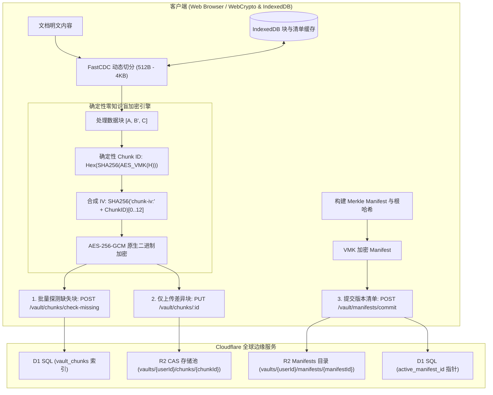

<div align="center">


# Markspace

**零信任 · 隐私优先 · 增量同步 · 边缘原生 Markdown 工作空间**

[](https://www.gnu.org/licenses/agpl-3.0)
[](https://www.typescriptlang.org/)
[](https://reactjs.org/)
[](https://vitejs.dev/)
[](https://workers.cloudflare.com/)
[](https://www.w3.org/TR/WebCryptoAPI/)

---

[English](README.md) | 简体中文 | [正體中文](README-zh-TW.md)

</div>

---

## 💡 何以 Markspace？

- **更完善的零知识隐私**：基于浏览器原生非导出 Web Crypto 密钥（`extractable: false`），明文与密钥不出客户端内存沙箱。
- **FastCDC 动态切分与 Merkle DAG 增量同步**：512B~4KB 内容感知微块同步，仅传输修改块（节省 >90% 带宽），提供不可篡改版本树与秒级回退。
- **OPRF 盲化门禁与防重放安全**：NIST P-256 OPRF 盲校验凭据、RFC 9449 DPoP 设备绑定、挑战 Nonce 与 RFC 6238 TOTP 双重认证。
- **一体化工程与科学排版套件**：原生集成 KaTeX 公式引擎、Mermaid 动态图表 AST 与支持实时公式计算的可视化表格。
- **全球分布式边缘 Serverless 架构**：100% 部署于 Cloudflare 全球边缘网络（Workers + D1 + R2），零服务器运维负担，极速响应。

---

### ⚖️ 核心架构与特性对比

| 评估维度 / 特性能力 | 传统云端笔记 (Notion, 印象笔记) | 本地文件 / Git 同步 (Obsidian + Git/Sync) | **Markspace** |
| :--- | :--- | :--- | :--- |
| **零知识隐私 (Zero-Knowledge)** | ❌ 服务端可明文检视所有笔记与附件 | ⚠️ 依赖插件；凭证与密钥多以明文存盘 | **✅ 更完善的零知识（Web Crypto 不可导出密钥）** |
| **同步粒度 (Sync Granularity)** | ⚠️ 全量 JSON 覆盖或专有 Delta 数据流 | ❌ Git 全量 Blob 重写或繁重的 commit 树 | **✅ FastCDC (512B–4KB) 内容感知微块同步** |
| **传输与带宽利用率** | ❌ 每次修改均涉及较多冗余元数据与上传 | ⚠️ 小改动需生成并打包完整 Git objects | **✅ 节省 >90% 传输带宽（仅传输增量差异块）** |
| **版本控制与历史回退** | ⚠️ 云端托管快照；保留策略与隐私不透明 | ⚠️ 容易出现 Git 分支冲突与合并故障 | **✅ 加密 Merkle DAG 不可篡改时间线与秒级回退** |
| **凭证传输与认证安全** | ❌ 明文密码传输 / 服务端 Hash 存储 | ⚠️ 个人访问令牌 (PAT) 或 SSH Key 存盘 | **✅ WebAuthn FIDO2 Passkeys + NIST P-256 OPRF 盲校验 + TOTP** |
| **二进制媒体存储开销** | ⚠️ 常见 Base64 编码引入 33.3% 体积膨胀 | ❌ Git LFS 或大型二进制导致同步瓶颈 | **✅ 0% 额外开销 Raw Binary 原生二进制流** |
| **本地缓存与秒级重构** | ⚠️ 离线缓存受限 | ⚠️ `.git` 历史目录占用大量本地磁盘空间 | **✅ 浏览器 IndexedDB 微块缓存，亚毫秒还原** |
| **基础设施与部署成本** | ❌ 商业闭源锁定，数据无法完全掌控 | ⚠️ 需自建/维护 Git 伺服器或购买专有云 | **✅ 100% Serverless Cloudflare 边缘部署 (D1+R2)** |

---

## 📸 界面预览

<div align="center">

### Bento 零信任安全展台与登录门禁
```
+-----------------------------------------------------------------------------------+
|                                                                                   |
|                   [ Bento 零信任展台与安全认证面板 ]                               |
|                                                                                   |
|           • 3D 景深 Bento 展台，聚焦时 360° 放射状平移散开                        |
|           • WebAuthn FIDO2 Passkeys 硬件凭据、OPRF 盲化门禁 (NIST P-256) 与 TOTP   |
|           • FastCDC 动态切分与 Merkle DAG 拓扑技术规格动态展示                     |
|           • 硬件加速极暗主题残影流动与纯黑 OLED 画布                               |
|                                                                                   |
+-----------------------------------------------------------------------------------+
```
> *图 1：零知识 Lunchbox 风格 Bento 展台与交互式密码学技术规格详情。*

<br/>

### 双栏工作区、KaTeX 数学排版与 Mermaid 动态图表
```
+-----------------------------------------------------------------------------------+
|                                                                                   |
|                 [ 分列 Markdown 编辑器与实时预览 ]                                 |
|                                                                                   |
|           • 实时双栏对照与增量同步渲染                                            |
|           • 硬件加速 KaTeX 复杂数学公式排版                                       |
|           • Mermaid 动态流程图、时序图与状态机可视化                              |
|           • Lezer AST 语法解析器与多语言高精度代码高亮                            |
|                                                                                   |
+-----------------------------------------------------------------------------------+
```
> *图 2：沉浸式 Markdown 编辑器配合科学级学术排版与语法高亮。*

<br/>

### 可视化电子表格编辑器 (Visual Table Editor)
```
+-----------------------------------------------------------------------------------+
|                                                                                   |
|                 [ 可视化表格编辑与实时公式计算引擎 ]                              |
|                                                                                   |
|           • Markdown 笔记内嵌入式电子表格交互编辑                                 |
|           • 内置实时函数公式计算引擎（SUM, AVG, COUNT, IF 等）                    |
|           • 无损双向序列化为 GitHub Flavored Markdown (GFM) 标准表格              |
|                                                                                   |
+-----------------------------------------------------------------------------------+
```
> *图 3：类 Excel 的所见即所得表格操作与动态算术/函数评估。*

<br/>

### Merkle DAG 版本时光机与历史回滚
```
+-----------------------------------------------------------------------------------+
|                                                                                   |
|                 [ Merkle DAG 块级版本树与无损回退 ]                               |
|                                                                                   |
|           • FastCDC 内容感知差异化块级同步                                        |
|           • Merkle DAG 不可篡改提交时间线与 SHA-256 根哈希                        |
|           • 浏览器本地 IndexedDB 块缓存，0 网络毫秒级重组与历史对比                |
|                                                                                   |
+-----------------------------------------------------------------------------------+
```
> *图 4：基于加密哈希的不可篡改历史记录与无损回溯。*

</div>

---

## ✨ 核心特性

### 🧩 FastCDC 动态内容分块与差异增量同步
- **细粒度自适应切分**：采用 64-bit Gear-hash 滚动哈希自适应识别内容边界（`最小 512B`、`平均 1KB`、`最大 4KB`），彻底消除了固定分块带来的雪崩移位效应。
- **差异块增量同步**：保存时自动探测服务端缺失块，仅上传变更的 512B ~ 1KB 增量密文块与轻量 Manifest 清单，上行带宽节省 90%+。
- **IndexedDB 本地块缓存**：已解密的块与 Manifest 清单在浏览器本地 IndexedDB 中进行毫秒级缓存，历史版本检视与 Diff 对比 **0 网络请求极速重组**。

### 🛡️ 确定性零知识盲块加密与 CAS 存储池
- **非可导出密钥安全执行**：直接使用 Web Crypto API 的不可导出密钥（`extractable: false`）执行原生 AES-256-GCM 运算，杜绝堆内存转储与冷启动泄露。
- **Vault 内部盲去重**：通过私有 $VMK$ 派生确定性 Chunk ID（$H = \text{SHA-256}(Chunk)$ 经由 $VMK$ 加密），同一 Vault 内相同内容自动去重。
- **跨用户强加密隔离**：不同用户的私有 $VMK$ 完全隔离，相同明文生成截然不同的 Chunk ID 与密文，彻底免疫服务端的频次分析与字典攻击。
- **Raw Binary (0% 冗余) 存储**：彻底清除 Base64 编码带来的 33.3% 体积膨胀，原生采用 ArrayBuffer / Uint8Array 二进制流存储在 R2 中。

### 🌲 Merkle DAG 版本树与时间线回退
- **不可篡改版本清单**：每次保存均构建轻量加密 Manifest 记录有序 Chunk 拓扑并计算 Merkle Root Hash，形成不可篡改的 DAG 版本树。
- **点对点精确时间回滚**：支持任意历史版本的无损检视与一键回退，无需服务端重新构建整个文件。

### 🔑 硬件级 Passkeys (WebAuthn / FIDO2) 与 OPRF 灾难恢复
- **零知识硬件绑定 Passkeys**：全面支持 WebAuthn / FIDO2 硬件标准（Touch ID、Windows Hello、Face ID、YubiKey、Google 密码管理工具、Apple iCloud 钥匙串与 1Password），通过 WebAuthn PRF 确定性派生 256 位高熵 Passkey Vault Key (PVK)。
- **单用户多 Passkey 绑定与管理**：支持在个人中心集中查看、重命名与管理多个设备/硬件安全密钥。
- **NIST P-256 椭圆曲线 OPRF 灾难恢复盲化门禁**：客户端在传输前对助记词凭据进行盲化计算，服务端在不知晓明文的情况下完成校验，彻底抵御离线字典与撞库爆破。
- **8 词 BIP-39 助记词冷恢复**：创建 Vault 时生成标准 8 词助记词，全面支持空格与连字符（`-`）分词，提供极致离线容灾。
- **RFC 6238 TOTP 双重认证**：支持 30 秒动态令牌轮转，兼容主流身份验证器。
- **RFC 9449 DPoP 与 Nonce 熔断**：通过 6 字节挑战 Nonce 与设备令牌实时绑定，重放尝试立即触发熔断。

### 👤 用户政策、存储配额与闲置自动销毁
- **Unix 规范凭据**：用户名遵循 Unix 格式（`5–32` 字符，`/^[a-z_][a-z0-9_-]{4,31}$/`，仅限小写字母、数字、下划线与短横线，首字符为字母或下划线），系统内全局唯一；密码采用 Unix 格式（`12–128` 字符），不强制字符成分复杂度。
- **全局唯一 User UUID**：每位用户绑定唯一的 UUID 标识符，支持控制台一键快捷复制。
- **精细化存储配额管控 (1MB – 1TB)**：非管理员用户默认拥有 `10MB` 存储配额，系统管理员可按需在 `1MB` 到 `1TB` 区间内调整全局默认或指定用户配额，分块与文件写入执行硬上限拦截。
- **100 条审计日志保留上限**：每位用户的零信任安全与操作审计日志自动剪裁并最多保留最新 100 条记录，UI 显式声明。
- **闲置账户生命周期销毁机制**：非管理员用户最后在线时间超过闲置阈值（默认 `1 个月`，支持管理员配置 `1 个月` 至 `1 年`，亦可关闭）将自动由 Worker Cron 定时任务彻底级联销毁用户与其全部 Vault 数据，UI 关键节点显式声明备份与自部署提示。
- **系统管理员控制台**：支持系统管理员集中查看所有用户的 UUID、创建时间、最后在线时间、存储消耗、调整用户角色/配额，以及手动或定时触发闲置用户清理。

### 📊 交互式可视化表格编辑器
- **所见即所得表格网格**：在 Markdown 笔记中直接增删行列、调整对齐与单元格内容。
- **实时公式引擎**：内置数学计算引擎，支持 `SUM`、`AVG`、`COUNT`、`MIN`、`MAX`、`IF` 及基础算术表达式。
- **GFM 无损转换**：与标准 GitHub Flavored Markdown 表格语法无缝互转。

### 📐 科学与工程排版套件
- **KaTeX 数学公式引擎**：支持行内公式（`$...$`）与块级公式（`$$...$$`）的高性能渲染。
- **Mermaid 动态图表 AST**：直接根据代码块生成流程图、时序图、类图与甘特图。
- **Lezer 增量语法解析**：支持 Markdown、JavaScript、Python、CSS、HTML、JSON 等语言的高速语法高亮。

### 🌐 全要素国际化多语言 (i18n)
- 原生支持 8 种主流语言无缝切换：
  - 🇨🇳 简体中文 (`zh-CN`) | 🇭🇰/🇹🇼 正體中文 (`zh-TW`) | 🇺🇸 English (`en-US`) | 🇯🇵 日本語 (`ja-JP`)
  - 🇰🇷 한국어 (`ko-KR`) | 🇩🇪 Deutsch (`de-DE`) | 🇪🇸 Español (`es-ES`) | 🇻🇳 Tiếng Việt (`vi-VN`)

### 🎨 OLED 纯黑美学与排版
- 针对纯黑 OLED 背景（`#050507`）调校的高对比度视觉体验。
- 深度集成 **GitHub Monaspace Neon** 代码等宽字体与 **Noto 全语言多文种字族**。

---

## 🏗️ 架构与存储拓扑



---

## 🚀 快速上手

### 环境准备
- [Node.js](https://nodejs.org/) (v18.0.0 或更高版本)
- [npm](https://www.npmjs.com/) (v9.0.0 或更高版本) 或 [pnpm](https://pnpm.io/)
- [Cloudflare Wrangler CLI](https://developers.cloudflare.com/workers/wrangler/)

### 1. 克隆并安装依赖
```bash
git clone https://github.com/your-username/markspace.git
cd markspace
npm install
```

### 2. 本地数据库迁移 (Cloudflare D1)
```bash
npm run d1:migrate:local
```

### 3. 启动开发服务器
```bash
# 终端 1：启动边缘 API 后端
npm run dev:api

# 终端 2：启动前端 UI 开发服务器
npm run dev:ui
```
在浏览器中打开 `http://localhost:5173` 即可开始使用。

---

## 🚢 部署发布

### 1. 远程数据库迁移
```bash
# 首次创建 D1 数据库（如未创建）
npm run d1:create

# 将迁移应用至线上生产数据库
npm run d1:migrate:prod
```

### 2. 构建与部署 Worker
```bash
npm run deploy
```

---

## 🛠️ 技术栈清单

| 层次 | 核心技术 |
| :--- | :--- |
| **前端框架** | React 18, TypeScript, Vite |
| **样式与设计** | Tailwind CSS, Lucide React, Monaspace Neon |
| **文档处理** | Marked, Lezer AST, KaTeX, Mermaid.js |
| **分块与版本控制** | FastCDC (Gear-Hash), Merkle DAG, IndexedDB Local Cache |
| **密码学套件** | Web Crypto API (SubtleCrypto, 非导出密钥), AES-256-GCM, OPRF NIST P-256, DPoP RFC 9449 |
| **边缘计算与存储** | Cloudflare Workers, Cloudflare D1 SQL, Cloudflare R2 CAS 对象存储 |
| **Monorepo 工具链** | npm workspaces, TypeScript Project References |

---

## 📄 开源许可证

本项目采用 **GNU Affero General Public License v3.0 (AGPLv3)** 开源许可证。  
详细信息请参阅 [LICENSE](LICENSE) 文件。
