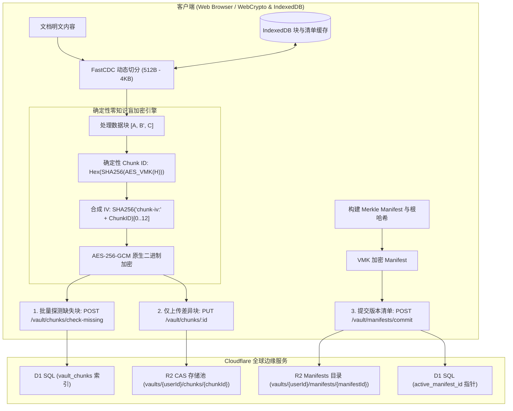

<div align="center">


# Markspace

**零信任 · 隐私优先 · 增量同步 · 边缘原生 Markdown 工作空间**

[](https://www.gnu.org/licenses/agpl-3.0)
[](https://www.typescriptlang.org/)
[](https://reactjs.org/)
[](https://vitejs.dev/)
[](https://workers.cloudflare.com/)
[](https://www.w3.org/TR/WebCryptoAPI/)

---

[English](README.md) | [简体中文](README-zh-CN.md) | 正體中文

</div>

---

## 💡 何以 Markspace？

- **更完善的零知識隱私**：基於瀏覽器原生非導出 Web Crypto 金鑰（`extractable: false`），明文與金鑰不出客戶端記憶體沙箱。
- **FastCDC 動態切分與 Merkle DAG 增量同步**：512B~4KB 內容感知微塊同步，僅傳輸修改塊（節省 >90% 頻寬），提供不可篡改版本樹與秒級回退。
- **多元第三方儲存與零知識憑證**：支援第一方 Cloudflare R2、標準 S3 相容儲存、主流商業網盤（Google Drive / OneDrive / Dropbox / 阿里雲盤 / 誇克網盤）及 WebDAV 協定，敏感憑據全量客戶端 AES-256-GCM 零知識加密。
- **OPRF 盲化門禁與防重放安全**：NIST P-256 OPRF 盲校驗憑據、RFC 9449 DPoP 設備綁定、挑戰 Nonce 與 RFC 6238 TOTP 雙重認證。
- **一體化工程與科學排版套件**：原生整合 KaTeX 公式引擎、Mermaid 動態圖表 AST 與支援即時公式計算的可視化表格。
- **全球分散式邊緣 Serverless 架構**：100% 部署於 Cloudflare 全球邊緣網路（Workers + D1 + R2），零伺服器維運負擔，極速回應。

<p align="center">
  <a href="https://deploy.workers.cloudflare.com/?url=https://github.com/Obein/Markspace">
    
  </a>
</p>

---

### ⚖️ 核心架構與特性對比

| 評估維度 / 特性能力 | 傳統雲端筆記 (Notion, 印象筆記) | 本機檔案 / Git 同步 (Obsidian + Git/Sync) | **Markspace** |
| :--- | :--- | :--- | :--- |
| **零知識隱私 (Zero-Knowledge)** | ❌ 伺服端可明文檢視所有筆記與附件 | ⚠️ 依賴外掛；憑據與金鑰多以明文存盤 | **✅ 更完善的零知識（Web Crypto 不可導出金鑰）** |
| **同步粒度 (Sync Granularity)** | ⚠️ 全量 JSON 覆蓋或專有 Delta 數據流 | ❌ Git 全量 Blob 重寫或繁重的 commit 樹 | **✅ FastCDC (512B–4KB) 內容感知微塊同步** |
| **儲存後端與網盤拓展** | ❌ 封閉私有雲鎖定 | ⚠️ 依賴本機檔案或繁瑣的第三方同步外掛 | **✅ 原生 R2 + S3 相容 + 商業網盤 + WebDAV 自由切換** |
| **傳輸與頻寬利用率** | ❌ 每次修改均涉及較多冗餘元數據與上傳 | ⚠️ 小改動需生成並打包完整 Git objects | **✅ 節省 >90% 傳輸頻寬（僅傳輸增量差異塊）** |
| **版本控制與歷史回退** | ⚠️ 雲端託管快照；保留策略與隱私不透明 | ⚠️ 容易出現 Git 分支衝突與合併故障 | **✅ 加密 Merkle DAG 不可篡改時間線與秒級回退** |
| **憑證傳輸與認證安全** | ❌ 明文密碼傳輸 / 伺服端 Hash 儲存 | ⚠️ 個人訪問權杖 (PAT) 或 SSH Key 存盤 | **✅ WebAuthn FIDO2 Passkeys + NIST P-256 OPRF 盲校驗 + TOTP** |
| **二進位媒體儲存開銷** | ⚠️ 常見 Base64 編碼引入 33.3% 體積膨脹 | ❌ Git LFS 或大型二進位導致同步瓶頸 | **✅ 0% 額外開銷 Raw Binary 原生二進位流** |
| **本機快取與秒級重構** | ⚠️ 離線快取受限 | ⚠️ `.git` 歷史目錄占用大量本機磁碟空間 | **✅ 瀏覽器 IndexedDB 微塊快取，亞毫秒還原** |
| **基礎設施與部署成本** | ❌ 商業閉源鎖定，數據無法完全掌控 | ⚠️ 需自建/維護 Git 伺服器或購買專有雲 | **✅ 100% Serverless Cloudflare 邊緣部署 (D1+R2)** |

---

## 📸 介面預覽

<p align="center">
  
</p>
<p align="center">
  <em>Bento 零信任安全展台與登入門禁</em>
</p>

<table>
  <tr>
    <td width="50%" align="center">
      <br />
      <b>沉浸式編輯模式</b>
    </td>
    <td width="50%" align="center">
      <br />
      <b>獨立預覽模式</b>
    </td>
  </tr>
  <tr>
    <td width="50%" align="center">
      <br />
      <b>分列雙欄 KaTeX 數學排版</b>
    </td>
    <td width="50%" align="center">
      <br />
      <b>分列雙欄 Mermaid 動態圖表</b>
    </td>
  </tr>
  <tr>
    <td width="50%" align="center">
      <br />
      <b>視覺化電子試算表編輯器</b>
    </td>
    <td width="50%" align="center">
      <br />
      <b>Merkle DAG 版本時光機與歷史回退</b>
    </td>
  </tr>
</table>

---

## ✨ 核心特性

### 🧩 FastCDC 動態內容分塊與差異增量同步
- **細粒度自適應切分**：採用 64-bit Gear-hash 滾動雜湊自適應識別內容邊界（`最小 512B`、`平均 1KB`、`最大 4KB`），徹底消除了固定分塊帶來的雪崩移位效應。
- **差異塊增量同步**：儲存時自動探測伺服端缺失塊，僅上傳變更的 512B ~ 1KB 增量密文塊與輕量 Manifest 清單，上行頻寬節省 90%+。
- **IndexedDB 本機塊快取**：已解密的塊與 Manifest 清單在瀏覽器本機 IndexedDB 中進行毫秒級快取，歷史版本檢視與 Diff 對比 **0 網路請求極速重組**。

### 🗄️ 多元第三方儲存支援與零知識憑證加密 (S3 / 商業網盤 / WebDAV)
- **多協定全生態儲存接入**：
  - **第一方原生儲存 (First-Party)**：預設 Cloudflare R2 物件儲存，開箱即用；
  - **S3 相容物件儲存 (S3-Compatible)**：AWS S3、Cloudflare R2 (S3 API)、MinIO、阿里雲 OSS、騰訊雲 COS、Backblaze B2、Wasabi 及自訂 Endpoint / Path Style 支援；
  - **主流商業網盤 (Commercial Cloud Drive)**：Google Drive、Microsoft OneDrive、Dropbox、阿里雲盤、誇克網盤；
  - **標準 WebDAV 協定 (WebDAV Protocol)**：堅果雲 (Jianguoyun)、Nextcloud、ownCloud、Synology DSM 與自建 WebDAV 伺服器。
- **端到端零知識加密憑證儲存 (Zero-Knowledge E2EE)**：
  - 儲存憑證（如 Secret Access Key、WebDAV 密碼、網盤 OAuth/API Token）在離開瀏覽器前使用客戶端 **AES-256-GCM** 完成強加密；
  - 伺服端與 D1 資料庫僅保存高強度密文與 IV，伺服端無從知曉明文憑證；
  - 登入新裝置或切換瀏覽器時，後台自動從雲端同步密文並在客戶端本機解密還原。
- **即時連通性探針 (Real-Time Connectivity Probe)**：提供即時網路與憑證連通性測試，在儲存並綁定前預先驗證權限與連通狀態。
- **無 R2 獨立運行能力 (Smart Storage Fallback)**：系統智慧感知後端環境是否綁定 R2 Bucket；在未關聯第一方 R2 時，建立 Vault 自動前置引導並強制設定第三方儲存方案，實現零 R2 強依賴下的完全獨立運行。

### 🛡️ 確定性零知識盲塊加密與 CAS 儲存池
- **非可匯出金鑰安全執行**：使用 Web Crypto API 的不可匯出金鑰（`extractable: false`）執行原生 AES-256-GCM 運算，金鑰不寫入 LocalStorage 或磁碟介質，降低金鑰持久化洩漏風險。
- **Vault 內部盲去重**：透過私有 $VMK$ 派生確定性 Chunk ID（$H = \text{SHA-256}(Chunk)$ 經由 $VMK$ 加密），同一 Vault 內相同內容自動去重。
- **跨使用者強加密隔離**：不同使用者的私有 $VMK$ 完全隔離，相同明文生成截然不同的 Chunk ID 與密文，徹底免疫伺服端的頻次分析與字典攻擊。
- **Raw Binary (0% 冗餘) 儲存**：徹底清除 Base64 編碼帶來的 33.3% 體積膨脹，原生採用 ArrayBuffer / Uint8Array 二進位流儲存在 R2 中。

### 🌲 Merkle DAG 版本樹與時間線回退
- **不可篡改版本清单**：每次保存均构建轻量加密 Manifest 记录有序 Chunk 拓扑并计算 Merkle Root Hash，形成不可篡改的 DAG 版本树。
- **点对点精确时间回滚**：支持任意历史版本的无损检视与一键回退，无需服务端重新构建整个文件。

### 🔑 硬件级 Passkeys (WebAuthn / FIDO2) 与 OPRF 灾难恢复
- **零知识硬件绑定 Passkeys**：全面支持 WebAuthn / FIDO2 硬件标准（Touch ID、Windows Hello、Face ID、YubiKey、Google 密码管理工具、Apple iCloud 钥匙串与 1Password），通过 WebAuthn PRF 确定性派生 256 位高熵 Passkey Vault Key (PVK)。
- **单用户多 Passkey 绑定与管理**：支持在个人中心集中查看、重命名与管理多个设备/硬件安全密钥。
- **NIST P-256 椭圆曲线 OPRF 灾难恢复盲化门禁**：客户端在传输前对助记词凭据进行盲化计算，服务端在不知晓明文的情况下完成校验，彻底抵御离线字典与撞库爆破。
- **8 词 BIP-39 助记词冷恢复**：创建 Vault 时生成标准 8 词助记词，全面支持空格与连字符（`-`）分词，提供极致离线容灾。
- **RFC 6238 TOTP 双重认证**：支持 30 秒动态令牌轮转，兼容主流身份验证器。
- **RFC 9449 DPoP 与 Nonce 熔断**：通过 6 字节挑战 Nonce 与设备令牌实时绑定，重放尝试立即触发熔断。

### 👤 用户政策、存储配额与闲置自动销毁
- **Unix 规范凭据**：用户名遵循 Unix 格式（`5–32` 字符，`/^[a-z_][a-z0-9_-]{4,31}$/`，仅限小写字母、数字、下划线与短横线，首字符为字母或下划线），系统内全局唯一；密码采用 Unix 格式（`12–128` 字符），不强制字符成分复杂度。
- **全局唯一 User UUID**：每位用户绑定唯一的 UUID 标识符，支持控制台一键快捷复制。
- **精细化存储配额管控 (1MB – 1TB)**：非管理员用户默认拥有 `10MB` 存储配额，系统管理员可按需在 `1MB` 到 `1TB` 区间内调整全局默认或指定用户配额，分块与文件写入执行硬上限拦截。
- **100 条审计日志保留上限**：每位用户的零信任安全与操作审计日志自动剪裁并最多保留最新 100 条记录，UI 显式声明。
- **闲置账户生命周期销毁机制**：非管理员用户最后在线时间超过闲置阈值（默认 `1 个月`，支持管理员配置 `1 个月` 至 `1 年`，亦可关闭）将自动由 Worker Cron 定时任务彻底级联销毁用户与其全部 Vault 数据，UI 关键节点显式声明备份与自部署提示。
- **系统管理员控制台**：支持系统管理员集中查看所有用户的 UUID、创建时间、最后在线时间、存储消耗、调整用户角色/配额，以及手动或定时触发闲置用户清理。

### 📊 交互式可视化表格编辑器
- **所见即所得表格网格**：在 Markdown 笔记中直接增删行列、调整对齐与单元格内容。
- **实时公式引擎**：内置数学计算引擎，支持 `SUM`、`AVG`、`COUNT`、`MIN`、`MAX`、`IF` 及基础算术表达式。
- **GFM 无损转换**：与标准 GitHub Flavored Markdown 表格语法无缝互转。

### 📐 科学与工程排版套件
- **KaTeX 数学公式引擎**：支持行内公式（`$...$`）与块级公式（`$$...$$`）的高性能渲染。
- **Mermaid 动态图表 AST**：直接根据代码块生成流程图、时序图、类图与甘特图。
- **Lezer 增量语法解析**：支持 Markdown、JavaScript、Python、CSS、HTML、JSON 等语言的高速语法高亮。

### 🌐 全要素国际化多语言 (i18n)
- 原生支持 8 种主流语言无缝切换：
  - 🇨🇳 简体中文 (`zh-CN`) | 🇭🇰/🇹🇼 正體中文 (`zh-TW`) | 🇺🇸 English (`en-US`) | 🇯🇵 日本語 (`ja-JP`)
  - 🇰🇷 한국어 (`ko-KR`) | 🇩🇪 Deutsch (`de-DE`) | 🇪🇸 Español (`es-ES`) | 🇻🇳 Tiếng Việt (`vi-VN`)

### 🎨 OLED 纯黑美学与排版
- 针对纯黑 OLED 背景（`#050507`）调校的高对比度视觉体验。
- 深度集成 **GitHub Monaspace Neon** 代码等宽字体与 **Noto 全语言多文种字族**。

---

## 🏗️ 架构与存储拓扑



---

## 🚀 快速上手

### 环境准备
- [Node.js](https://nodejs.org/) (v18.0.0 或更高版本)
- [npm](https://www.npmjs.com/) (v9.0.0 或更高版本) 或 [pnpm](https://pnpm.io/)
- [Cloudflare Wrangler CLI](https://developers.cloudflare.com/workers/wrangler/)

### 1. 克隆并安装依赖
```bash
git clone https://github.com/your-username/markspace.git
cd markspace
npm install
```

### 2. 本地数据库迁移 (Cloudflare D1)
```bash
npm run d1:migrate:local
```

### 3. 启动开发服务器
```bash
# 终端 1：启动边缘 API 后端
npm run dev:api

# 终端 2：启动前端 UI 开发服务器
npm run dev:ui
```
在浏览器中打开 `http://localhost:5173` 即可开始使用。

---

## 🚢 部署发布

### 🌐 方式一：Cloudflare 控制台 Web 界面一键部署 (推荐)

通过 Cloudflare 官方部署按钮一键直达全球边缘网络：

<p align="center">
  <a href="https://deploy.workers.cloudflare.com/?url=https://github.com/Obein/Markspace">
    
  </a>
</p>

#### 1. 建置與路徑設定 (Build Settings)
在 Cloudflare 控制台 (Workers & Pages / Workers Builds) 匯入或設定專案時：
- **根目錄 (Root Directory)**：`/` (專案根目錄)
- **建置命令 (Build Command)**：`npm run build` (或 `npm run build:ui`)
- **部署命令 (Deploy Command)**：`npm run deploy` (或 `npx wrangler deploy --workspace=apps/api`)
- **靜態資產輸出目錄 (Build Output Directory)**：`apps/ui/dist`
- **Worker 後端進入點**：`apps/api/src/index.ts`

#### 2. Cloudflare 資源綁定 (Bindings)
進入 **Cloudflare 控制台** -> **Workers 和 Pages** -> **markspace** -> **設定 (Settings)** -> **綁定 (Bindings)**：

| 綁定類型 (Binding Type) | 變數名稱 (Variable Name) | 綁定目標與說明 |
| :--- | :--- | :--- |
| **D1 資料庫** | `DB` | 綁定至 D1 資料庫：`markspace-db` |
| **R2 儲存貯體** | `BUCKET` | 綁定至 R2 儲存貯體：`markspace-media-bucket`（選填，未綁定時支援純第三方儲存運行） |
| **靜態資產 (Static Assets)** | `ASSETS` | 透過 `wrangler.jsonc` 自動對應至 `apps/ui/dist` |

> [!NOTE]
> **資料庫初次初始化 (D1 Migrations)**：
> 在 **Cloudflare 控制台** -> **儲存與資料庫** -> **D1** -> `markspace-db` -> **主控台 (Console)** 中執行 [`apps/api/migrations/0001_initial_schema.sql`](apps/api/migrations/0001_initial_schema.sql) 內的 SQL 語句，或在本地透過 Wrangler 執行 `npm run d1:migrate:prod`。

#### 3. 環境變數與機密金鑰設定 (Variables and Secrets)
進入 **設定 (Settings)** -> **變數與機密 (Variables and Secrets)**，新增以下必填設定：

| 名稱 (Name) | 類型 (Type) | 說明 (Description) | 產生命令/範例 |
| :--- | :--- | :--- | :--- |
| `JWT_SECRET` | **機密 (Secret / 加密)** | 使用者工作階段 JWT 鑑權簽章金鑰（建議 ≥32 字元高熵字串） | `openssl rand -base64 32` (或密碼產生器隨機字串) |
| `MASTER_ENCRYPTION_KEY` | **機密 (Secret / 加密)** | 256 位元十六進位主金鑰（64 位元 Hex 字元），用於 TOTP 與 OPRF 信封加密 | `openssl rand -hex 32` (或 64 位元十六進位產生器) |
| `ENVIRONMENT` | **變數 (Variable / 明文)** | 運行環境識別標記 | `production` |

---

### 💻 方式二：CLI 命令列部署 (Cloudflare Wrangler)

```bash
# 1. 首次建立生產 D1 資料庫與 R2 儲存貯體 (選填)
npx wrangler d1 create markspace-db
npx wrangler r2 bucket create markspace-media-bucket

# 2. 設定生產機密金鑰
npx wrangler secret put JWT_SECRET --workspace=apps/api
npx wrangler secret put MASTER_ENCRYPTION_KEY --workspace=apps/api

# 3. 執行 D1 遠端資料庫遷移
npm run d1:migrate:prod

# 4. 建置前端產物並一鍵部署 Worker
npm run deploy
```

---

## 🛠️ 技术栈清单

| 层次 | 核心技术 |
| :--- | :--- |
| **前端框架** | React 18, TypeScript, Vite |
| **样式与设计** | Tailwind CSS, Lucide React, Monaspace Neon |
| **文档处理** | Marked, Lezer AST, KaTeX, Mermaid.js |
| **分块与版本控制** | FastCDC (Gear-Hash), Merkle DAG, IndexedDB Local Cache |
| **密码学套件** | Web Crypto API (SubtleCrypto, 非导出密钥), AES-256-GCM, OPRF NIST P-256, DPoP RFC 9449 |
| **边缘计算与存储** | Cloudflare Workers, Cloudflare D1 SQL, Cloudflare R2 CAS 对象存储 |
| **Monorepo 工具链** | npm workspaces, TypeScript Project References |

---

## 📄 开源许可证

本项目采用 **GNU Affero General Public License v3.0 (AGPLv3)** 开源许可证。  
详细信息请参阅 [LICENSE](LICENSE) 文件。

