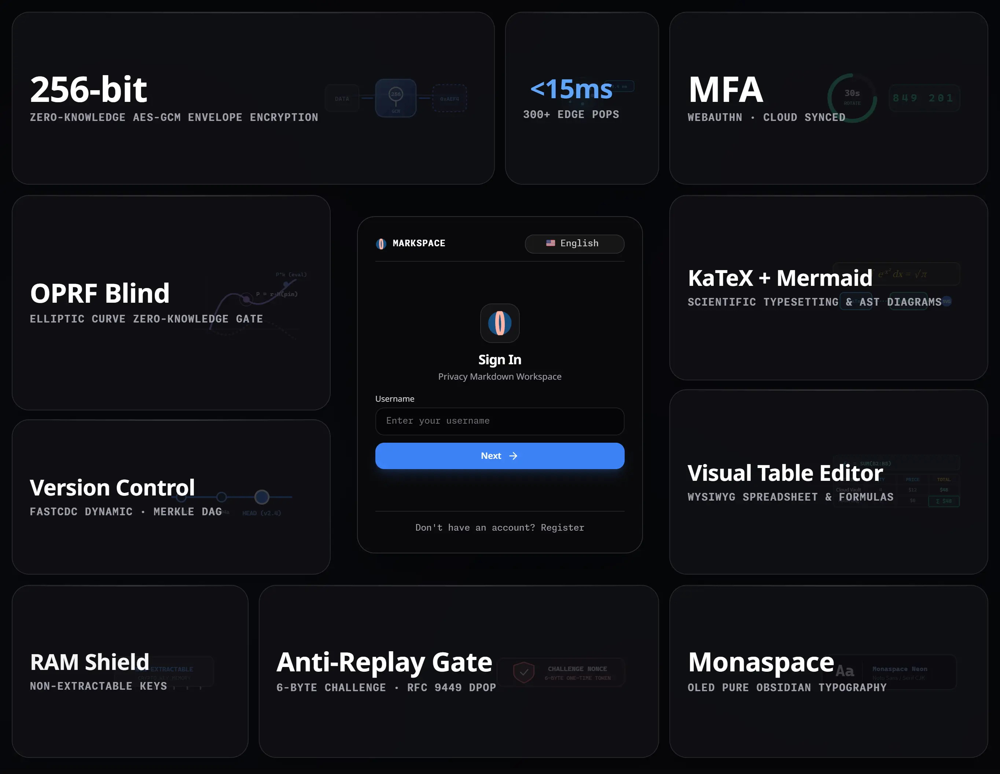
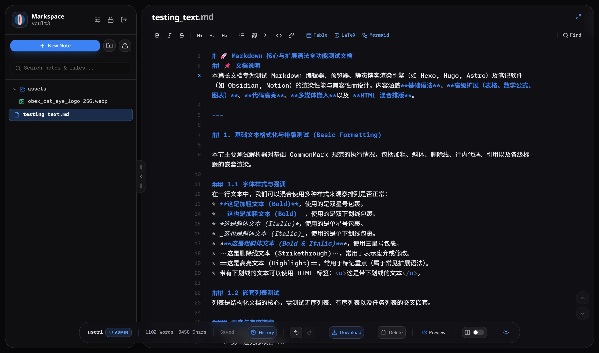
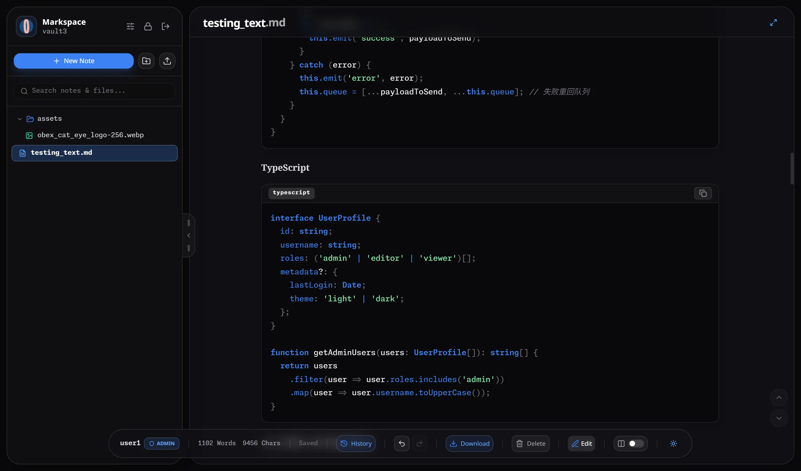
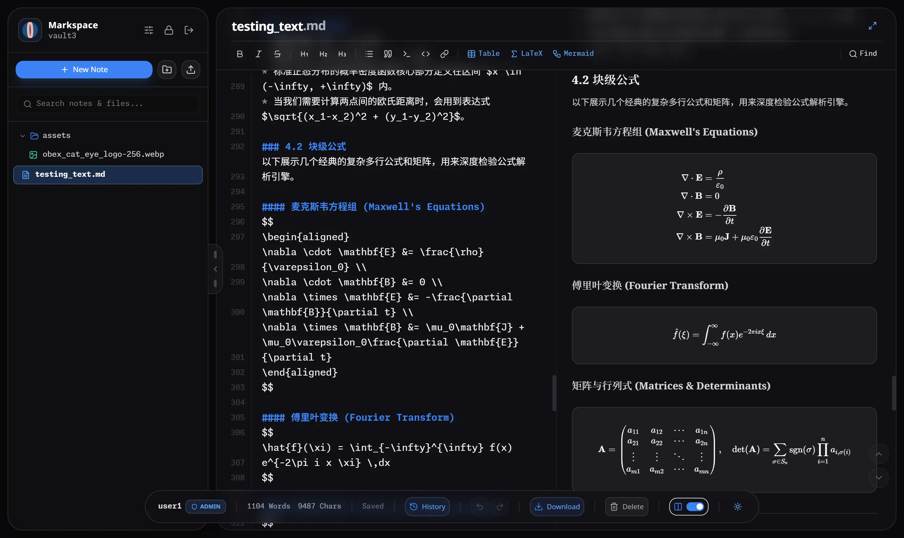
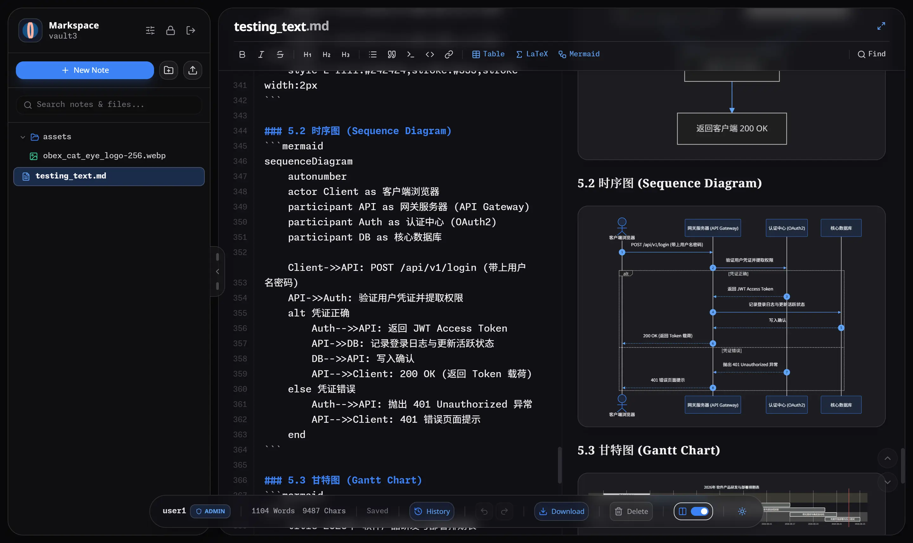
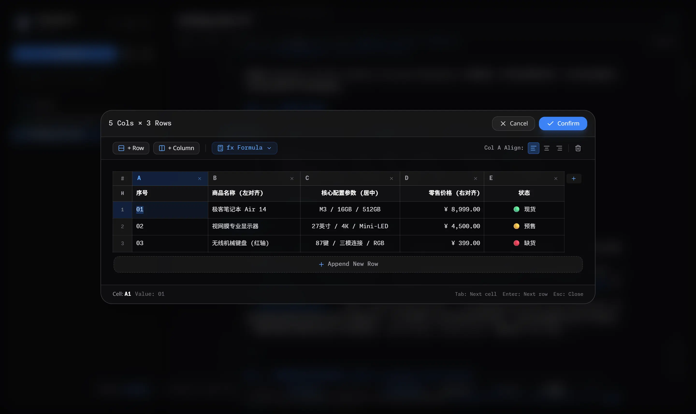
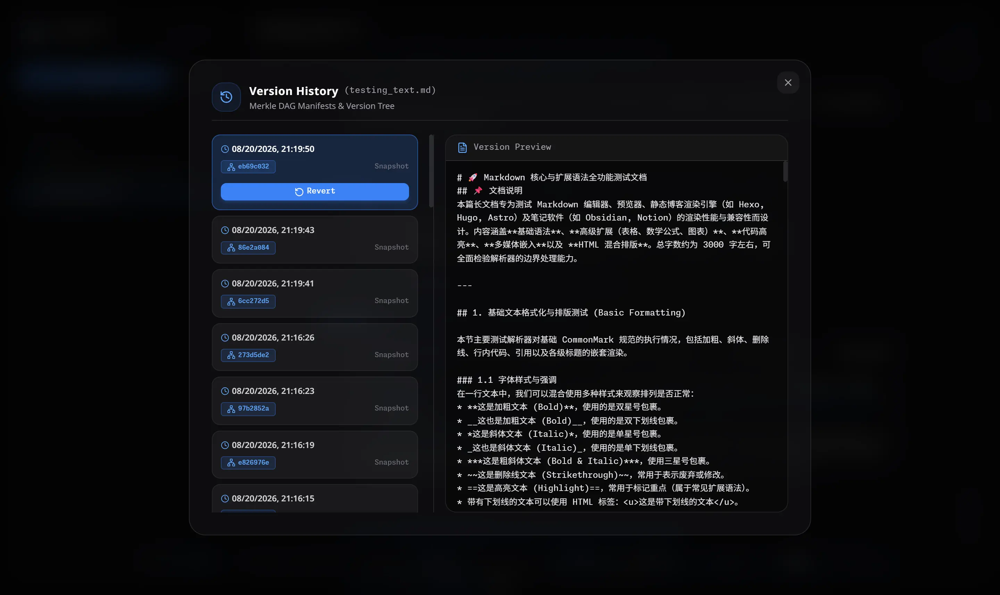
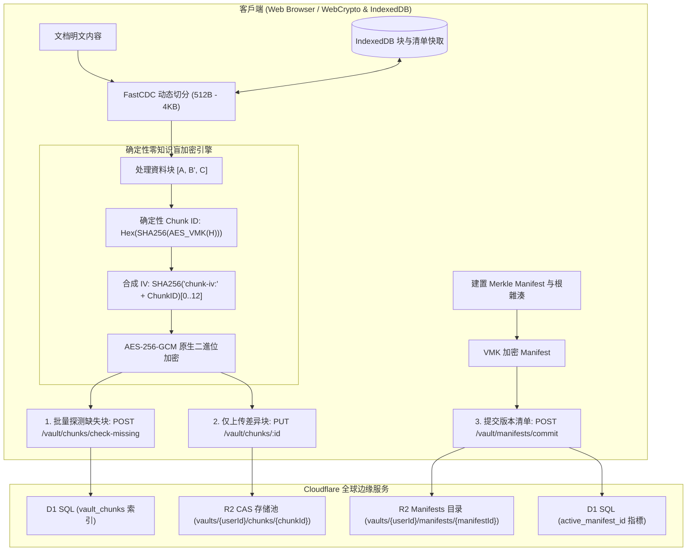

<div align="center">


# Markspace

**零信任 · 隐私优先 · 增量同步 · 边缘原生 Markdown 工作空间**

[](https://www.gnu.org/licenses/agpl-3.0)
[](https://www.typescriptlang.org/)
[](https://reactjs.org/)
[](https://vitejs.dev/)
[](https://workers.cloudflare.com/)
[](https://www.w3.org/TR/WebCryptoAPI/)

---

[English](README.md) | [简体中文](README-zh-CN.md) | 正體中文

</div>

---

## 💡 何以 Markspace？

- **更完善的零知識隱私**：基於瀏覽器原生非匯出 Web Crypto 金鑰（`extractable: false`），明文與金鑰不出用戶端記憶體沙箱。
- **FastCDC 動態切分與 Merkle DAG 增量同步**：512B~4KB 內容感知微塊同步，僅傳輸修改塊（節省 >90% 頻寬），提供不可篡改版本樹與秒級回復。
- **OPRF 盲化門禁與防重放安全**：NIST P-256 OPRF 盲校驗憑證、RFC 9449 DPoP 裝置綁定、挑戰 Nonce 與 RFC 6238 TOTP 雙重認證。
- **一體化工程與科學排版套件**：原生整合 KaTeX 公式引擎、Mermaid 動態圖表 AST 與支援即時公式計算的可視化試算表。
- **全球分散式邊緣 Serverless 架構**：100% 部署於 Cloudflare 全球邊緣網路（Workers + D1 + R2），零伺服器維運負擔，極速回應。

---

### ⚖️ 核心架構與特性對比

| 評估維度 / 特性能力 | 傳統雲端筆記 (Notion, 印象筆記) | 本地檔案 / Git 同步 (Obsidian + Git/Sync) | **Markspace** |
| :--- | :--- | :--- | :--- |
| **零知識隱私 (Zero-Knowledge)** | ❌ 伺服端可明文檢視所有筆記與附件 | ⚠️ 依賴外掛程式；憑證與金鑰多以明文存盤 | **✅ 更完善的零知識（Web Crypto 不可匯出金鑰）** |
| **同步粒度 (Sync Granularity)** | ⚠️ 全量 JSON 覆蓋或專有 Delta 資料流 | ❌ Git 全量 Blob 重寫或繁重的 commit 樹 | **✅ FastCDC (512B–4KB) 內容感知微塊同步** |
| **傳輸與頻寬利用率** | ❌ 每次修改均涉及較多冗餘中繼資料與上傳 | ⚠️ 小改動需產生並打包完整 Git objects | **✅ 節省 >90% 傳輸頻寬（僅傳輸增量差異塊）** |
| **版本控制與歷史回復** | ⚠️ 雲端託管快照；保留策略與隱私不透明 | ⚠️ 容易出現 Git 分支衝突與合併故障 | **✅ 加密 Merkle DAG 不可篡改時間線與秒級回復** |
| **憑證傳輸與認證安全** | ❌ 明文密碼傳輸 / 伺服端 Hash 儲存 | ⚠️ 個人存取權杖 (PAT) 或 SSH Key 存盤 | **✅ WebAuthn FIDO2 Passkeys + NIST P-256 OPRF 盲校驗 + TOTP** |
| **二進位媒體儲存開銷** | ⚠️ 常見 Base64 編碼引入 33.3% 體積膨脹 | ❌ Git LFS 或大型二進位導致同步瓶頸 | **✅ 0% 額外開銷 Raw Binary 原生二進位流** |
| **本地快取與秒級重構** | ⚠️ 離線快取受限 | ⚠️ `.git` 歷史目錄占用大量本機磁碟空間 | **✅ 瀏覽器 IndexedDB 微塊快取，亞毫秒還原** |
| **基礎設施與部署成本** | ❌ 商業閉源鎖定，資料無法完全掌控 | ⚠️ 需自建/維護 Git 伺服器或購買專有雲 | **✅ 100% Serverless Cloudflare 邊緣部署 (D1+R2)** |

---

## 📸 介面預覽

<p align="center">
  
</p>
<p align="center">
  <em>Bento 零信任安全展台與登入門禁</em>
</p>

<table>
  <tr>
    <td width="50%" align="center">
      <br />
      <b>沉浸式編輯模式</b>
    </td>
    <td width="50%" align="center">
      <br />
      <b>獨立預覽模式</b>
    </td>
  </tr>
  <tr>
    <td width="50%" align="center">
      <br />
      <b>分列雙欄 KaTeX 數學排版</b>
    </td>
    <td width="50%" align="center">
      <br />
      <b>分列雙欄 Mermaid 動態圖表</b>
    </td>
  </tr>
  <tr>
    <td width="50%" align="center">
      <br />
      <b>視覺化試算表編輯器</b>
    </td>
    <td width="50%" align="center">
      <br />
      <b>Merkle DAG 版本時光機與歷史回退</b>
    </td>
  </tr>
</table>

---

## ✨ 核心特性

### 🧩 FastCDC 动态内容分块与差异增量同步
- **细粒度自适应切分**：采用 64-bit Gear-hash 滚动雜湊自适应识别内容边界（`最小 512B`、`平均 1KB`、`最大 4KB`），彻底消除了固定分块带来的雪崩移位效应。
- **差异块增量同步**：保存时自动探测伺服端缺失块，仅上传变更的 512B ~ 1KB 增量密文块与轻量 Manifest 清单，上行頻寬节省 90%+。
- **IndexedDB 本地块快取**：已解密的块与 Manifest 清单在浏览器本地 IndexedDB 中进行毫秒级快取，历史版本检视与 Diff 对比 **0 網路请求极速重组**。

### 🛡️ 确定性零知识盲块加密与 CAS 存储池
- **非可导出金鑰安全执行**：直接使用 Web Crypto API 的不可匯出金鑰（`extractable: false`）执行原生 AES-256-GCM 运算，杜绝堆記憶體转储与冷启动泄露。
- **Vault 内部盲去重**：通过私有 $VMK$ 派生确定性 Chunk ID（$H = \text{SHA-256}(Chunk)$ 经由 $VMK$ 加密），同一 Vault 内相同内容自动去重。
- **跨用户强加密隔离**：不同用户的私有 $VMK$ 完全隔离，相同明文生成截然不同的 Chunk ID 与密文，彻底免疫伺服端的频次分析与字典攻击。
- **Raw Binary (0% 冗余) 存储**：彻底清除 Base64 编码带来的 33.3% 体积膨胀，原生采用 ArrayBuffer / Uint8Array 二進位流存储在 R2 中。

### 🌲 Merkle DAG 版本树与时间线回退
- **不可篡改版本清单**：每次保存均建置轻量加密 Manifest 记录有序 Chunk 拓扑并计算 Merkle Root Hash，形成不可篡改的 DAG 版本树。
- **点对点精确时间回滚**：支援任意历史版本的无损检视与一键回退，无需伺服端重新建置整个檔案。

### 🔑 硬件级 Passkeys (WebAuthn / FIDO2) 与 OPRF 灾难恢复
- **零知识硬體綁定 Passkeys**：全面支援 WebAuthn / FIDO2 硬體標準（Touch ID、Windows Hello、Face ID、YubiKey、Google 密碼管理工具、Apple iCloud 鑰匙圈與 1Password），透過 WebAuthn PRF 確定性衍生 256 位元高熵 Passkey Vault Key (PVK)。
- **單一使用者多 Passkey 綁定與管理**：支援在個人中心集中檢視、重新命名與管理多個裝置/硬體安全金鑰。
- **NIST P-256 橢圓曲線 OPRF 災難復原盲化門禁**：用戶端在傳輸前對助記詞憑證進行盲化運算，伺服端在不知曉明文的情況下完成校驗，徹底抵禦離線字典與撞庫爆破。
- **8 詞 BIP-39 助記詞冷復原**：建立 Vault 時產生標準 8 詞助記詞，全面支援空格與連字號（`-`）分詞，提供極致離線容災。
- **RFC 6238 TOTP 雙重認證**：支援 30 秒動態權杖輪轉，相容主流身分驗證器。
- **RFC 9449 DPoP 與 Nonce 熔斷**：透過 6 位元組挑戰 Nonce 與裝置權杖即時綁定，重放嘗試立即觸發熔斷。

### 👤 使用者政策、儲存配額與閒置自動銷毀
- **Unix 規範憑證**：使用者名稱遵循 Unix 格式（`5–32` 字元，`/^[a-z_][a-z0-9_-]{4,31}$/`，僅限小寫字母、數字、底線與連字號，首字元為字母或底線），系統內全域唯一；密碼採用 Unix 格式（`12–128` 字元），不強制字元成分複雜度。
- **全域唯一 User UUID**：每位使用者綁定唯一的 UUID 識別碼，支援控制台一鍵快捷複製。
- **精細化儲存配額管控 (1MB – 1TB)**：非管理員使用者預設擁有 `10MB` 儲存配額，系統管理員可按需在 `1MB` 到 `1TB` 區間內調整全域預設或指定使用者配額，分塊與檔案寫入執行硬上限攔截。
- **100 條審計日誌保留上限**：每位使用者的零信任安全與操作審計日誌自動剪裁並最多保留最新 100 條記錄，UI 顯式宣告。
- **閒置帳戶生命週期銷毀機制**：非管理員使用者最後在線時間超過閒置閾值（預設 `1 個月`，支援管理員設定 `1 個月` 至 `1 年`，亦可關閉）將自動由 Worker Cron 定時任務徹底級聯銷毀使用者與其全部 Vault 資料，UI 關鍵節點顯式宣告備份與自部署提示。
- **系統管理員控制台**：支援系統管理員集中檢視所有使用者的 UUID、建立時間、最後在線時間、儲存消耗、調整使用者角色/配额，以及手動或定時觸發閒置使用者清理。

### 📊 交互式可视化試算表编辑器
- **所见即所得試算表网格**：在 Markdown 笔记中直接增删行列、调整对齐与单元格内容。
- **实时公式引擎**：内置数学计算引擎，支援 `SUM`、`AVG`、`COUNT`、`MIN`、`MAX`、`IF` 及基础算术表达式。
- **GFM 无损转换**：与标准 GitHub Flavored Markdown 試算表语法无缝互转。

### 📐 科学与工程排版套件
- **KaTeX 数学公式引擎**：支援行内公式（`$...$`）与块级公式（`$$...$$`）的高性能渲染。
- **Mermaid 动态图表 AST**：直接根据程式碼块生成流程图、循序圖、類別圖与甘特图。
- **Lezer 增量语法解析**：支援 Markdown、JavaScript、Python、CSS、HTML、JSON 等语言的高速语法醒目提示。

### 🌐 全要素国际化多语言 (i18n)
- 原生支援 8 种主流语言无缝切换：
  - 🇨🇳 简体中文 (`zh-CN`) | 🇭🇰/🇹🇼 正體中文 (`zh-TW`) | 🇺🇸 English (`en-US`) | 🇯🇵 日本語 (`ja-JP`)
  - 🇰🇷 한국어 (`ko-KR`) | 🇩🇪 Deutsch (`de-DE`) | 🇪🇸 Español (`es-ES`) | 🇻🇳 Tiếng Việt (`vi-VN`)

### 🎨 OLED 纯黑美学与排版
- 针对纯黑 OLED 背景（`#050507`）调校的高对比度视觉体验。
- 深度集成 **GitHub Monaspace Neon** 程式碼等宽字体与 **Noto 全语言多文种字族**。

---

## 🏗️ 架构与存储拓扑



---

## 🚀 快速上手

### 环境准备
- [Node.js](https://nodejs.org/) (v18.0.0 或更高版本)
- [npm](https://www.npmjs.com/) (v9.0.0 或更高版本) 或 [pnpm](https://pnpm.io/)
- [Cloudflare Wrangler CLI](https://developers.cloudflare.com/workers/wrangler/)

### 1. 複製并安装依赖
```bash
git clone https://github.com/your-username/markspace.git
cd markspace
npm install
```

### 2. 本地資料库迁移 (Cloudflare D1)
```bash
npm run d1:migrate:local
```

### 3. 启动开发服务器
```bash
# 終端 1：启动边缘 API 后端
npm run dev:api

# 終端 2：启动前端 UI 开发服务器
npm run dev:ui
```
在浏览器中打开 `http://localhost:5173` 即可开始使用。

---

## 🚢 部署發佈

### 1. 远程資料库迁移
```bash
# 首次建立 D1 資料库（如未建立）
npm run d1:create

# 将迁移应用至线上生产資料库
npm run d1:migrate:prod
```

### 2. 建置与部署 Worker
```bash
npm run deploy
```

---

## 🛠️ 技術棧清單

| 层次 | 核心技术 |
| :--- | :--- |
| **前端框架** | React 18, TypeScript, Vite |
| **样式与设计** | Tailwind CSS, Lucide React, Monaspace Neon |
| **文档处理** | Marked, Lezer AST, KaTeX, Mermaid.js |
| **分块与版本控制** | FastCDC (Gear-Hash), Merkle DAG, IndexedDB Local Cache |
| **密码学套件** | Web Crypto API (SubtleCrypto, 非导出金鑰), AES-256-GCM, OPRF NIST P-256, DPoP RFC 9449 |
| **边缘计算与存储** | Cloudflare Workers, Cloudflare D1 SQL, Cloudflare R2 CAS 物件儲存 |
| **Monorepo 工具链** | npm workspaces, TypeScript Project References |

---

## 📄 開源授權

本项目采用 **GNU Affero General Public License v3.0 (AGPLv3)** 開源授權。  
详细信息请参阅 [LICENSE](LICENSE) 檔案。
