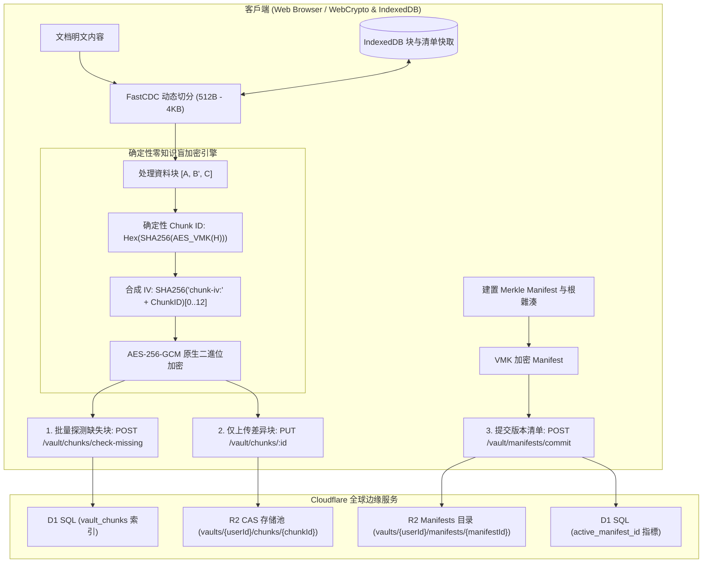

<div align="center">


# Markspace

**零信任 · 隐私优先 · FastCDC 与 Merkle DAG 边缘原生 Markdown 工作空间**

[](https://www.gnu.org/licenses/agpl-3.0)
[](https://www.typescriptlang.org/)
[](https://reactjs.org/)
[](https://vitejs.dev/)
[](https://workers.cloudflare.com/)
[](https://www.w3.org/TR/WebCryptoAPI/)

---

[English](README.md) | [简体中文](README-zh-CN.md) | 正體中文

</div>

---

## 📖 專案概覽

**Markspace** 是一款基于数学信封加密、**FastCDC 内容感知动态分块**与**加密 Merkle DAG 块级增量同步**打造的现代隐私原生 Markdown 空间。

通过利用浏览器原生 Web Crypto API 的不可匯出金鑰（`extractable: false`），Markspace 将所有的明文加解密运算严格隔离在客戶端記憶體沙箱中，确保伺服端、存储节点和網路中继始终处于完全零知识（Zero-Knowledge）状态。Markspace 全面弃用了单檔案全量覆盖与 Git 镜像全量快照机制，采用专业备份级的內容定址存储（CAS）架构：文档经由 FastCDC 自适应切分为 512B ~ 4KB 微块，通过确定性 AES-256-GCM 盲加密后，每次保存仅上传发生修改的差异块与加密 Manifest 清单，极大节省網路頻寬。

---

## 📸 介面預覽 (Quick Look)

<div align="center">

### Bento 零信任安全展台与登录门禁
```
+-----------------------------------------------------------------------------------+
|                                                                                   |
|                   [ Bento 零信任展台与安全认证面板 ]                               |
|                                                                                   |
|           • 3D 景深 Bento 展台，聚焦时 360° 放射状平移散开                        |
|           • OPRF 椭圆曲线盲化安全门禁 (NIST P-256) 与 TOTP 动态验证器集成         |
|           • FastCDC 动态切分与 Merkle DAG 拓扑技术规格动态展示                     |
|           • 硬件加速极暗主题残影流动与纯黑 OLED 画布                               |
|                                                                                   |
+-----------------------------------------------------------------------------------+
```
> *图 1：零知识 Lunchbox 风格 Bento 展台与交互式密码学技术规格详情。*

<br/>

### 双栏工作区、KaTeX 数学排版与 Mermaid 动态图表
```
+-----------------------------------------------------------------------------------+
|                                                                                   |
|                 [ 分列 Markdown 编辑器与实时预览 ]                                 |
|                                                                                   |
|           • 实时双栏对照与增量同步渲染                                            |
|           • 硬件加速 KaTeX 复杂数学公式排版                                       |
|           • Mermaid 动态流程图、循序圖与状态机可视化                              |
|           • Lezer AST 语法解析器与多语言高精度程式碼醒目提示                            |
|                                                                                   |
+-----------------------------------------------------------------------------------+
```
> *图 2：沉浸式 Markdown 编辑器配合科学级学术排版与语法醒目提示。*

<br/>

### 可视化电子試算表编辑器 (Visual Table Editor)
```
+-----------------------------------------------------------------------------------+
|                                                                                   |
|                 [ 可视化試算表编辑与实时公式计算引擎 ]                              |
|                                                                                   |
|           • Markdown 笔记内嵌入式电子試算表交互编辑                                 |
|           • 内置实时函数公式计算引擎（SUM, AVG, COUNT, IF 等）                    |
|           • 无损双向序列化为 GitHub Flavored Markdown (GFM) 标准試算表              |
|                                                                                   |
+-----------------------------------------------------------------------------------+
```
> *图 3：类 Excel 的所见即所得試算表操作与动态算术/函数评估。*

<br/>

### Merkle DAG 版本时光机与历史回滚
```
+-----------------------------------------------------------------------------------+
|                                                                                   |
|                 [ Merkle DAG 块级版本树与无损回退 ]                               |
|                                                                                   |
|           • FastCDC 内容感知差异化块级同步                                        |
|           • Merkle DAG 不可篡改提交时间线与 SHA-256 根雜湊                        |
|           • 浏览器本地 IndexedDB 块快取，0 網路毫秒级重组与历史对比                |
|                                                                                   |
+-----------------------------------------------------------------------------------+
```
> *图 4：基于加密雜湊的不可篡改历史记录与无损回溯。*

</div>

---

## ✨ 核心特性

### 🧩 FastCDC 动态内容分块与差异增量同步
- **细粒度自适应切分**：采用 64-bit Gear-hash 滚动雜湊自适应识别内容边界（`最小 512B`、`平均 1KB`、`最大 4KB`），彻底消除了固定分块带来的雪崩移位效应。
- **差异块增量同步**：保存时自动探测伺服端缺失块，仅上传变更的 512B ~ 1KB 增量密文块与轻量 Manifest 清单，上行頻寬节省 90%+。
- **IndexedDB 本地块快取**：已解密的块与 Manifest 清单在浏览器本地 IndexedDB 中进行毫秒级快取，历史版本检视与 Diff 对比 **0 網路请求极速重组**。

### 🛡️ 确定性零知识盲块加密与 CAS 存储池
- **非可导出金鑰安全执行**：直接使用 Web Crypto API 的不可匯出金鑰（`extractable: false`）执行原生 AES-256-GCM 运算，杜绝堆記憶體转储与冷启动泄露。
- **Vault 内部盲去重**：通过私有 $VMK$ 派生确定性 Chunk ID（$H = \text{SHA-256}(Chunk)$ 经由 $VMK$ 加密），同一 Vault 内相同内容自动去重。
- **跨用户强加密隔离**：不同用户的私有 $VMK$ 完全隔离，相同明文生成截然不同的 Chunk ID 与密文，彻底免疫伺服端的频次分析与字典攻击。
- **Raw Binary (0% 冗余) 存储**：彻底清除 Base64 编码带来的 33.3% 体积膨胀，原生采用 ArrayBuffer / Uint8Array 二進位流存储在 R2 中。

### 🌲 Merkle DAG 版本树与时间线回退
- **不可篡改版本清单**：每次保存均建置轻量加密 Manifest 记录有序 Chunk 拓扑并计算 Merkle Root Hash，形成不可篡改的 DAG 版本树。
- **点对点精确时间回滚**：支援任意历史版本的无损检视与一键回退，无需伺服端重新建置整个檔案。

### 🚪 OPRF 椭圆曲线盲化门禁与多因素认证
- **NIST P-256 椭圆曲线 OPRF**：客戶端在传输前对 PIN 凭据进行盲化，伺服端在不知晓明文的情况下完成校验，彻底抵御离线字典与撞库爆破。
- **BIP-39 助记词恢复卡片**：每个 Vault 初始化时生成 8 词 BIP-39 助记词卡，支援在不依赖伺服端的情况下安全重置 PIN。
- **RFC 6238 TOTP 双重认证**：支援 30 秒动态權杖轮转，相容 Google Authenticator、1Password 与 Apple 钥匙串。
- **RFC 9449 DPoP 与 Nonce 熔斷**：通过 6 位元組挑战 Nonce 与裝置權杖实时绑定，重放尝试立即触发熔斷。

### 👤 使用者政策、儲存配額與閒置自動銷毀
- **Unix 規範憑證**：使用者名稱遵循 Unix 格式（`5–32` 字元，`/^[a-z_][a-z0-9_-]{4,31}$/`，僅限小寫字母、數字、底線與連字號，首字元為字母或底線），系統內全域唯一；密碼採用 Unix 格式（`12–128` 字元），不強制字元成分複雜度。
- **全域唯一 User UUID**：每位使用者綁定唯一的 UUID 識別碼，支援控制台一鍵快捷複製。
- **精細化儲存配額管控 (1MB – 1TB)**：非管理員使用者預設擁有 `10MB` 儲存配額，系統管理員可按需在 `1MB` 到 `1TB` 區間內調整全域預設或指定使用者配額，分塊與檔案寫入執行硬上限攔截。
- **100 條審計日誌保留上限**：每位使用者的零信任安全與操作審計日誌自動剪裁並最多保留最新 100 條記錄，UI 顯式宣告。
- **閒置帳戶生命週期銷毀機制**：非管理員使用者最後在線時間超過閒置閾值（預設 `1 個月`，支援管理員設定 `1 個月` 至 `1 年`，亦可關閉）將自動由 Worker Cron 定時任務徹底級聯銷毀使用者與其全部 Vault 資料，UI 關鍵節點顯式宣告備份與自部署提示。
- **系統管理員控制台**：支援系統管理員集中檢視所有使用者的 UUID、建立時間、最後在線時間、儲存消耗、調整使用者角色/配额，以及手動或定時觸發閒置使用者清理。

### 📊 交互式可视化試算表编辑器
- **所见即所得試算表网格**：在 Markdown 笔记中直接增删行列、调整对齐与单元格内容。
- **实时公式引擎**：内置数学计算引擎，支援 `SUM`、`AVG`、`COUNT`、`MIN`、`MAX`、`IF` 及基础算术表达式。
- **GFM 无损转换**：与标准 GitHub Flavored Markdown 試算表语法无缝互转。

### 📐 科学与工程排版套件
- **KaTeX 数学公式引擎**：支援行内公式（`$...$`）与块级公式（`$$...$$`）的高性能渲染。
- **Mermaid 动态图表 AST**：直接根据程式碼块生成流程图、循序圖、類別圖与甘特图。
- **Lezer 增量语法解析**：支援 Markdown、JavaScript、Python、CSS、HTML、JSON 等语言的高速语法醒目提示。

### 🌐 全要素国际化多语言 (i18n)
- 原生支援 8 种主流语言无缝切换：
  - 🇨🇳 简体中文 (`zh-CN`) | 🇭🇰/🇹🇼 正體中文 (`zh-TW`) | 🇺🇸 English (`en-US`) | 🇯🇵 日本語 (`ja-JP`)
  - 🇰🇷 한국어 (`ko-KR`) | 🇩🇪 Deutsch (`de-DE`) | 🇪🇸 Español (`es-ES`) | 🇻🇳 Tiếng Việt (`vi-VN`)

### 🎨 OLED 纯黑美学与排版
- 针对纯黑 OLED 背景（`#050507`）调校的高对比度视觉体验。
- 深度集成 **GitHub Monaspace Neon** 程式碼等宽字体与 **Noto 全语言多文种字族**。

---

## 🏗️ 架构与存储拓扑



---

## 🚀 快速上手

### 环境准备
- [Node.js](https://nodejs.org/) (v18.0.0 或更高版本)
- [npm](https://www.npmjs.com/) (v9.0.0 或更高版本) 或 [pnpm](https://pnpm.io/)
- [Cloudflare Wrangler CLI](https://developers.cloudflare.com/workers/wrangler/)

### 1. 複製并安装依赖
```bash
git clone https://github.com/your-username/markspace.git
cd markspace
npm install
```

### 2. 本地資料库迁移 (Cloudflare D1)
```bash
npm run d1:migrate:local
```

### 3. 启动开发服务器
```bash
# 終端 1：启动边缘 API 后端
npm run dev:api

# 終端 2：启动前端 UI 开发服务器
npm run dev:ui
```
在浏览器中打开 `http://localhost:5173` 即可开始使用。

---

## 🚢 部署發佈

### 1. 远程資料库迁移
```bash
# 首次建立 D1 資料库（如未建立）
npm run d1:create

# 将迁移应用至线上生产資料库
npm run d1:migrate:prod
```

### 2. 建置与部署 Worker
```bash
npm run deploy
```

---

## 🛠️ 技術棧清單

| 层次 | 核心技术 |
| :--- | :--- |
| **前端框架** | React 18, TypeScript, Vite |
| **样式与设计** | Tailwind CSS, Lucide React, Monaspace Neon |
| **文档处理** | Marked, Lezer AST, KaTeX, Mermaid.js |
| **分块与版本控制** | FastCDC (Gear-Hash), Merkle DAG, IndexedDB Local Cache |
| **密码学套件** | Web Crypto API (SubtleCrypto, 非导出金鑰), AES-256-GCM, OPRF NIST P-256, DPoP RFC 9449 |
| **边缘计算与存储** | Cloudflare Workers, Cloudflare D1 SQL, Cloudflare R2 CAS 物件儲存 |
| **Monorepo 工具链** | npm workspaces, TypeScript Project References |

---

## 📄 開源授權

本项目采用 **GNU Affero General Public License v3.0 (AGPLv3)** 開源授權。  
详细信息请参阅 [LICENSE](LICENSE) 檔案。
