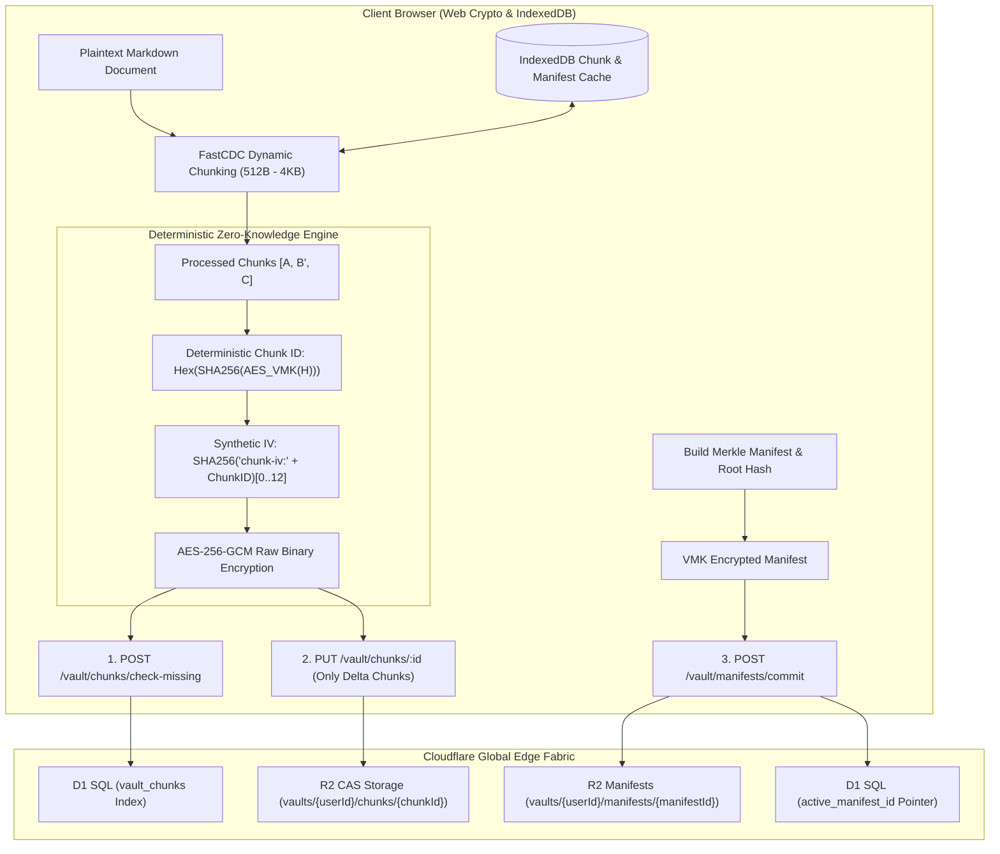

<div align="center">


# Markspace

**A Zero-Trust, Privacy-First, Incremental Synchronization, Edge-Native Markdown Workspace**

[](https://www.gnu.org/licenses/agpl-3.0)
[](https://www.typescriptlang.org/)
[](https://reactjs.org/)
[](https://vitejs.dev/)
[](https://workers.cloudflare.com/)
[](https://www.w3.org/TR/WebCryptoAPI/)

---

English | [简体中文](README-zh-CN.md) | [正體中文](README-zh-TW.md)

</div>

---

## 💡 Why Markspace?

- **More Robust Zero-Knowledge Privacy**: End-to-end envelope encryption via hardware-isolated, non-extractable Web Crypto keys (`extractable: false`).
- **FastCDC & Merkle DAG Block Sync**: Fine-grained content-defined chunking (`512B – 4KB`) transferring only modified blocks alongside immutable Merkle version trees.
- **OPRF Blind Gate & Zero-Replay Security**: NIST P-256 OPRF oblivious credential evaluation, RFC 9449 DPoP device token binding, and RFC 6238 TOTP.
- **Integrated Scientific & Engineering Workspace**: Hardware-accelerated KaTeX typesetting, dynamic Mermaid AST diagrams, and WYSIWYG spreadsheet table editor.
- **Edge-Native Serverless Architecture**: 100% serverless deployment on Cloudflare global edge fabric (Workers + D1 + R2) with zero maintenance.

---

### ⚖️ Architectural Comparison

| Dimension / Capability | Traditional Cloud Notes (Notion, Evernote) | File / Git Sync Notes (Obsidian + Git / Sync) | **Markspace** |
| :--- | :--- | :--- | :--- |
| **Zero-Knowledge Privacy** | ❌ Server can read all notes & attachments | ⚠️ Relies on plugins; keys often stored on disk | **✅ Robust Zero-Knowledge (Non-extractable Web Crypto AES-256-GCM)** |
| **Sync Granularity** | ⚠️ Monolithic JSON or proprietary delta stream | ❌ Full-file Git blob rewrite or heavy commit trees | **✅ FastCDC (512B–4KB) Content-Defined CAS Chunking** |
| **Bandwidth Efficiency** | ❌ High overhead with metadata/asset re-uploads | ⚠️ Git object packing overhead on small changes | **✅ >90% bandwidth saved (only delta chunks uploaded)** |
| **Version History & Rollback** | ⚠️ Cloud-managed snapshots; opaque retention | ⚠️ Git merge conflicts & branch divergence | **✅ Cryptographic Merkle DAG Immutable Version Tree** |
| **Credential & Passkey Security** | ❌ Plaintext password / server-side hash | ⚠️ Basic PAT / SSH keys stored in plaintext | **✅ WebAuthn FIDO2 Passkeys + NIST P-256 OPRF Blind Gate + TOTP** |
| **Storage & Transfer Overhead** | ⚠️ Base64 encoding inflates data by 33.3% | ❌ Git LFS / large binary sync bottleneck | **✅ 0% Overhead Raw Binary (`application/octet-stream`)** |
| **Local Cache & Reconstruction** | ⚠️ Limited offline caching | ⚠️ Heavy disk footprint with `.git` histories | **✅ IndexedDB client-side sub-millisecond block cache** |
| **Infrastructure & Deployment** | ❌ Proprietary closed-source vendor lock-in | ⚠️ Self-managed Git server / VPS maintenance | **✅ 100% Serverless Cloudflare Global Edge (Workers + D1 + R2)** |

---

## 📸 Quick Look

<div align="center">

### Bento Authentication & Zero-Trust Security Portal
```
+-----------------------------------------------------------------------------------+
|                                                                                   |
|                   [ Bento Auth & Zero-Trust Security Portal ]                     |
|                                                                                   |
|           • 3D Bento Grid Showcase with dynamic focal dispersion                  |
|           • WebAuthn FIDO2 Passkeys, OPRF Blind Gate (NIST P-256) & TOTP          |
|           • FastCDC & Merkle DAG live architecture visualization                  |
|           • Rotating ambient afterglow on pitch-black OLED canvas                 |
|                                                                                   |
+-----------------------------------------------------------------------------------+
```
> *Figure 1: Zero-knowledge lunchbox-style bento portal with interactive cryptographic details.*

<br/>

### Dual-Pane Workspace, KaTeX Typesetting & Mermaid AST Rendering
```
+-----------------------------------------------------------------------------------+
|                                                                                   |
|             [ Split-Pane Editor & Real-Time Live Preview ]                        |
|                                                                                   |
|           • Real-time split-pane live preview with incremental synchronization    |
|           • Hardware-accelerated KaTeX mathematical formula rendering             |
|           • Interactive dynamic Mermaid flowchart, sequence & AST diagrams        |
|           • Lezer AST multi-language syntax highlighting                          |
|                                                                                   |
+-----------------------------------------------------------------------------------+
```
> *Figure 2: Distraction-free Markdown editor paired with scientific typesetting and syntax highlighting.*

<br/>

### Interactive WYSIWYG Visual Table Editor
```
+-----------------------------------------------------------------------------------+
|                                                                                   |
|                   [ Visual Table & Live Formula Editor ]                          |
|                                                                                   |
|           • Embedded spreadsheet grid inside Markdown notes                       |
|           • Real-time formula computation engine (SUM, AVG, COUNT, IF, arithmetic)|
|           • Lossless bidirectional serialization to GitHub Flavored Markdown (GFM)|
|                                                                                   |
+-----------------------------------------------------------------------------------+
```
> *Figure 3: Spreadsheet-like table manipulation with live arithmetic and formula evaluations.*

<br/>

### Merkle DAG Version History & Instant Rollback
```
+-----------------------------------------------------------------------------------+
|                                                                                   |
|                  [ Merkle DAG Version Tree & Delta Rollback ]                     |
|                                                                                   |
|           • FastCDC content-defined differential block synchronization            |
|           • Merkle DAG immutable revision timeline with SHA-256 root hashes       |
|           • Local IndexedDB block caching for zero-network instant reconstruction |
|                                                                                   |
+-----------------------------------------------------------------------------------+
```
> *Figure 4: Immutable cryptographic revision history and non-destructive timeline restoration.*

</div>

---

## ✨ Key Features

### 🧩 FastCDC Dynamic Chunking & Differential Sync
- **Fine-Grained Content-Defined Chunking**: Employs a 64-bit Gear-hash rolling algorithm to detect natural content boundaries (`Min: 512B`, `Avg: 1KB`, `Max: 4KB`), completely eliminating the boundary-shift avalanche effect of fixed-size chunking.
- **Delta Block Synchronization**: Automatically identifies modified blocks on save. Uploads only the newly modified 512B–1KB chunks and an encrypted manifest, reducing network upload bandwidth by over 90%.
- **Local IndexedDB Block Cache**: Decrypted blocks and manifests are cached locally in the browser's IndexedDB, enabling zero-network, sub-millisecond document reconstruction and instant version history diffs.

### 🛡️ Deterministic Zero-Knowledge Block Encryption & CAS
- **Non-Extractable Key Operations**: Operates directly on non-extractable Web Crypto AES-256-GCM keys (`extractable: false`), preventing key export, heap scraping, or cold-boot memory dumps.
- **Deterministic Blind Deduplication**: Generates deterministic Chunk IDs using VMK-keyed cryptographic tokens ($H = \text{SHA-256}(Chunk)$ encrypted via VMK). Chunks with identical content in the same vault share identical IDs for blind deduplication.
- **Cross-User Cryptographic Isolation**: Because chunk derivation is salted with each user's private VMK, different users with identical text produce completely unrelated Chunk IDs and ciphertexts, fully immunizing against server-side frequency and dictionary attacks.
- **Raw Binary (0% Overhead) Storage**: Eliminates Base64 encoding overhead (which inflates data by 33%), storing encrypted chunks and blobs directly as raw binary streams (`application/octet-stream`).

### 🌲 Merkle DAG Version Tree & Immutable History
- **Immutable Revision Manifests**: Every save event constructs a lightweight, encrypted `FileManifest` referencing ordered Chunk IDs and parent manifest IDs, computing a cryptographic Merkle Root Hash.
- **Point-in-Time Non-Destructive Rollback**: Supports instant visual inspection and one-click rollback to any historical commit in the Merkle tree with zero server-side computation.

### 🔑 Hardware Passkeys (WebAuthn / FIDO2) & OPRF Disaster Recovery
- **Zero-Knowledge Hardware-Bound Passkeys**: Enforces WebAuthn / FIDO2 authentication across Touch ID, Windows Hello, Face ID, YubiKey, Google Password Manager, Apple iCloud Keychain, and 1Password. Generates high-entropy (256-bit) Passkey Vault Keys (PVK) via deterministic WebAuthn PRF or signature entropy.
- **Multi-Passkey User Management**: Users can bind and manage multiple Passkeys on different devices within the User Profile Console, complete with custom labels and device icons.
- **NIST P-256 Elliptic Curve OPRF Blind Gate**: Client blinds mnemonic recovery secrets before transmission; the server evaluates the challenge oblivious to plaintext, completely eliminating server-side brute-force and dictionary attacks.
- **8-Word BIP-39 Mnemonic Disaster Recovery**: Cold recovery phrase generated during vault creation with support for both spaces and Dash (`-`) tokenization, enabling instant offline disaster recovery.
- **RFC 6238 TOTP Multi-Factor Authentication**: Integrated 30-second rotating security tokens compatible with Google Authenticator, 1Password, and Apple Keychain.
- **RFC 9449 DPoP & Nonce Anti-Replay**: Cryptographic challenge nonces and DPoP device token bindings with automatic circuit breakers.

### 👤 User Policy, Storage Quotas & Lifecycle Sweeper
- **Unix-Compliant Credentials**: Usernames follow Unix conventions (`5–32` characters, `/^[a-z_][a-z0-9_-]{4,31}$/`, lowercase letters, digits, `_`, `-`, starting with a letter or `_`) and are globally unique; Passwords adhere to Unix formats (`12–128` characters) with zero arbitrary complexity rules.
- **Universal User UUID**: Every account is bound to an immutable User UUID with one-click clipboard copying.
- **Configurable Storage Quotas (1MB – 1TB)**: Standard users default to `10MB` storage capacity, configurable globally or per-user by administrators from `1MB` to `1TB`. Uploads exceeding quotas are rejected at the edge.
- **100-Entry Audit Log Cap**: Activity and zero-trust audit logs automatically retain the latest 100 entries per user with explicit UI declaration.
- **Automated Idle Account Destruction**: Inactive non-admin accounts exceeding the threshold (default `1 month`, configurable `1 month` to `1 year`, or disableable) are automatically swept and cascade-destroyed by Worker Cron jobs.
- **System Administration Console**: Dedicated administrator console for inspecting user UUIDs, registration and activity timestamps, storage usage, adjusting roles and quotas, and triggering lifecycle sweeps.

### 📊 Interactive Visual Table Editor
- **WYSIWYG Spreadsheet Grid**: Insert, delete, reorder rows/columns, and adjust alignments directly inside Markdown notes.
- **Live Formula Engine**: Built-in calculation engine supporting `SUM`, `AVG`, `COUNT`, `MIN`, `MAX`, `IF`, and mathematical expressions.
- **Lossless GFM Serialization**: Bidirectional serialization to standard GitHub Flavored Markdown table syntax.

### 📐 Scientific & Technical Typesetting
- **KaTeX Formula Engine**: High-performance mathematical typesetting supporting inline (`$...$`) and display (`$$...$$`) TeX blocks.
- **Dynamic Mermaid AST**: Renders flowcharts, sequence diagrams, state machines, and Gantt charts directly from fenced code blocks.
- **Lezer Incremental Parsing**: Incremental AST syntax highlighter for Markdown, JavaScript, Python, CSS, HTML, and JSON.

### 🌐 Universal Internationalization (i18n)
- Comprehensive multi-language localization across all UI dialogs, Bento cards, and editor tools:
  - 🇨🇳 简体中文 (`zh-CN`) | 🇭🇰/🇹🇼 正體中文 (`zh-TW`) | 🇺🇸 English (`en-US`) | 🇯🇵 日本語 (`ja-JP`)
  - 🇰🇷 한국어 (`ko-KR`) | 🇩🇪 Deutsch (`de-DE`) | 🇪🇸 Español (`es-ES`) | 🇻🇳 Tiếng Việt (`vi-VN`)

### 🎨 OLED Obsidian Typography
- Calibrated for infinite contrast on pitch-black OLED canvases (`#050507`).
- Integrates **GitHub Monaspace Neon** code typography with **Noto Multilingual** font families.

---

## 🏗️ Architecture & Storage Topology



---

## 🚀 Getting Started

### Prerequisites
- [Node.js](https://nodejs.org/) (v18.0.0 or higher)
- [npm](https://www.npmjs.com/) (v9.0.0 or higher) or [pnpm](https://pnpm.io/)
- [Cloudflare Wrangler CLI](https://developers.cloudflare.com/workers/wrangler/)

### 1. Clone & Install Dependencies
```bash
git clone https://github.com/your-username/markspace.git
cd markspace
npm install
```

### 2. Local Database Migrations (Cloudflare D1)
```bash
npm run d1:migrate:local
```

### 3. Start Development Servers
```bash
# Terminal 1: Edge Backend API
npm run dev:api

# Terminal 2: UI Dev Server
npm run dev:ui
```
Open `http://localhost:5173` to access the workspace.

---

## 🚢 Deployment

### 1. Remote Database Migrations
```bash
# Provision D1 database (if first time)
npm run d1:create

# Apply migrations to production database
npm run d1:migrate:prod
```

### 2. Build & Deploy Worker
```bash
npm run deploy
```

---

## 🛠️ Technology Stack

| Layer | Technologies |
| :--- | :--- |
| **Frontend Framework** | React 18, TypeScript, Vite |
| **Styling & Design** | Tailwind CSS, Lucide React, Monaspace Neon |
| **Document Processing**| Marked, Lezer AST, KaTeX, Mermaid.js |
| **Chunking & Versioning**| FastCDC (Gear-Hash), Merkle DAG, IndexedDB Local Cache |
| **Cryptography** | Web Crypto API (SubtleCrypto, Non-Extractable), AES-256-GCM, OPRF NIST P-256, DPoP RFC 9449 |
| **Edge Compute & Backend** | Cloudflare Workers, Cloudflare D1 SQL, Cloudflare R2 CAS Storage |
| **Monorepo Tooling** | npm workspaces, TypeScript Project References |

---

## 📄 License

This project is licensed under the **GNU Affero General Public License v3.0 (AGPLv3)**.  
See the [LICENSE](LICENSE) file for details.
